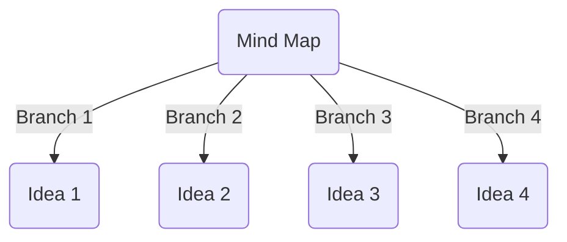

Date: Jan 7
Time: 5:15 pm to 6:15 pm
Chair: Nandini, Tarun, Samarth

Agenda: Market Analysis, Requirements Docs, Frame questions then document on zotero/LaTeX?, 

Discussion:
1) Chip fabrication/ software specification, simulation (Need to be discussed) -- Some suggestion given by sir on software use
2) Maximum volume of cloths/ time requirements -- 
3) What stains to be expected on cloths or disinfection?
4) What is the limitation wrt budget -- On hold for now
5) Load Capacity(Dry Weight): Water available, Type of washing (Pressure, or any other)
6) Material/Color of Cloth (GSM?)
7) Final product requirement -- Drying, how to be done?
8) Washing method?
9) Dimensions of the machine/Space availability?
10) Power available for the machine (Electric Plug/Port details. domestic purpose in home or else)?
11) Portability of the machine
12) Functions/modes of machine
13)  Input of cloths in the machine, manual/automatic/or anything else.
14) Output of the washed cloths
15) Noise concerns?
16) Goals of efficiency
17) What kind of solvents to be used?
18) Temperature environment of cleaning
19) Waste drainage management
20) Hazards 
21) Lifetime/Aesthetic requirement

Action:
Prepare doc of questions -- Market Research and Documentation Team

Test mind map in mermaid

